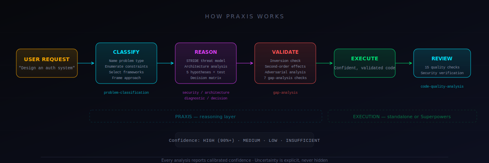
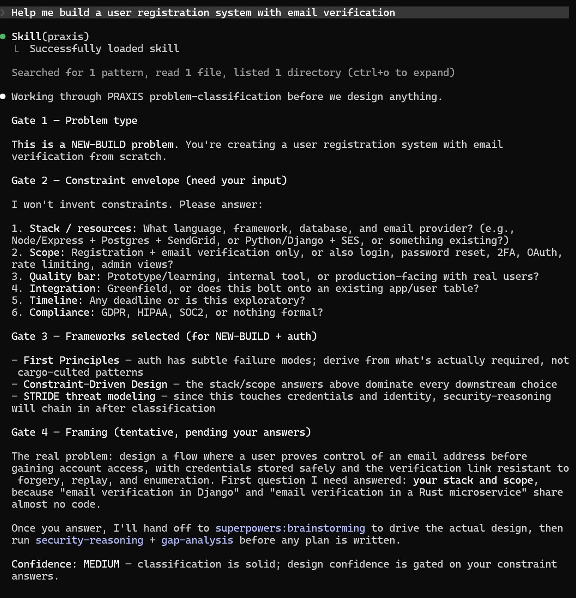

# Praxis

**A reasoning methodology plugin for AI coding agents.**

Praxis makes your agent think before it acts — classifying problems, selecting from 45 reasoning frameworks, enforcing cognitive checklists, and validating solutions before execution. It works standalone or alongside [Superpowers](https://github.com/obra/superpowers).

Superpowers tells agents **how to execute**. Praxis tells agents **how to think**. Together, your agent reasons deeply *then* executes precisely.




## What it actually does

Without Praxis, you say "design an auth system" and your agent starts asking generic questions or writing code immediately.

With Praxis:

```
You: Help me design an authentication system for our API

Agent: Skill(praxis) — Successfully loaded skill

GATE 1 — Problem type: EXTEND (adding auth to existing API).
GATE 2 — Constraints needed before designing:
  1. Clients: First-party web? Mobile? Third-party devs? Server-to-server?
  2. Session shape: Long-lived browser sessions? Short-lived API calls?
  3. Compliance: HIPAA, PCI, SOC2?
  4. Build vs buy: Open to Auth0/Clerk, or self-hosted?
GATE 3 — Frameworks: Separation of Concerns + Backward Compatibility + STRIDE
GATE 4 — The real problem isn't "pick JWT vs sessions" — it's matching auth
  architecture to your client mix, trust boundaries, and operational capacity.

Confidence: INSUFFICIENT (<50%) — cannot recommend without constraint envelope.
```

The agent classified the problem, selected reasoning frameworks, asked constraint-specific questions instead of generic ones, reframed the real problem, and reported calibrated confidence — all before writing a single line of code. Another example below:


## Test results

Built through iterations of testing and tuning. Every critical test passes.

| Test | What it proves | |
|---|---|---|
| T1: Trivial skip | Doesn't over-trigger on "fix this typo" |
| T4: Non-trivial activate | Fires problem-classification on design tasks |
| G2: Gap analysis | Runs all 7 cognitive debiasing checks |
| G3: Security auto-detect | Recognizes auth code without being told "security" |
| G4: Adversarial skip | Holds gate when user says "skip analysis, just code" |
| Q1: Diagnostic quality | 5 hypotheses + Strong Inference discriminating test |
| Q2: Decision quality | Adds "do nothing," asks weights, steelmans the loser |
| Q3: Code quality | Catches 17 violations including SQLi, MD5, no auth |
| Q4: Architecture quality | Reversibility, boundary analysis, bottleneck ID |
| S1: Superpowers handoff | Praxis reasons first, then Superpowers executes |

## The 8 skills

Each skill is a behavioral protocol with mandatory gates — not a reference document to browse.

| Skill | What it enforces | When it fires |
|---|---|---|
| **problem-classification** | 4 gates: name type → enumerate constraints → select frameworks → frame approach | Before any new design or feature |
| **gap-analysis** | 7 checks: inversion, second-order, MECE, map vs territory, adversarial, simplicity, reversibility | Before finalizing any design or plan |
| **security-reasoning** | STRIDE per trust boundary, attack surface table, top 3 mitigations | Auth, crypto, input handling, payments |
| **diagnostic-reasoning** | 5 hypotheses, Strong Inference discriminating test, 5 Whys root cause | Debugging and failure investigation |
| **code-quality-analysis** | 15 pass/fail checks across readability, structure, safety, purity, design | Writing, reviewing, or refactoring code |
| **architecture-reasoning** | Reversibility classification, build/buy/adopt, boundary analysis, bottleneck ID | Architecture and module decisions |
| **decision-analysis** | Weighted criteria, expected value, second-order, pre-mortem, steelman | Trade-offs and choosing between alternatives |
| **strategic-reasoning** | JTBD, SWOT with cross-referencing, kill list, measurable OKRs | Business strategy and roadmap decisions |

## Installation

### Claude Code (Manual)

```bash
# Linux/Mac
cp -r praxis ~/.claude/skills/praxis

# Windows
Drop the contents into: %USERPROFILE%\.claude\skills\praxis
```
Start a new Claude Code session. Praxis activates automatically on non-trivial tasks.

### With Superpowers

Install both. They compose automatically — Praxis reasons first, then hands off to Superpowers for TDD, subagent execution, and git workflow.

```
/plugin install superpowers@claude-plugins-official
```

### Verify

Ask for something non-trivial:

```
Help me design a notification service
```

Praxis should activate problem-classification before any work begins. If it doesn't, ask: "What skills do you have access to?" to verify the plugin loaded.

## How it works

Praxis is injected at session start via a SessionStart hook. The meta-skill establishes a complexity gate — trivial tasks (fix a typo, rename a variable) skip reasoning entirely. Non-trivial tasks (design, debug, architecture, security) must invoke the matching skill before the agent responds.

Each skill is a step-by-step protocol with `<HARD-GATE>` markers that prevent the agent from skipping steps. A `<RATIONALIZATION-CATCHING>` block in the meta-skill lists the exact thoughts agents have when they're about to skip reasoning — "I can handle this directly," "this is straightforward enough," "the user wants a quick answer" — and instructs the agent to recognize those impulses as the signal to invoke the skill, not skip it.

The YAML frontmatter description is the primary enforcement layer. Claude Code only shows descriptions to the agent at all times — the full skill body loads only after invocation. Descriptions are written as mandatory commands ("You MUST invoke...Do NOT respond directly") rather than passive suggestions.

## What we learned building it

Six iterations from a passive reference that agents ignored to behavioral enforcement that holds under adversarial pressure:

1. **The description IS the enforcement.** If it reads as a suggestion, the agent skips it.
2. **Sub-skill namespaces don't resolve locally.** `Skill(praxis)` works. `Skill(praxis:sub-name)` doesn't. Sub-protocols load via bash file reads.
3. **HARD-GATEs work — but only after invocation.** The description must compel invocation; body gates are second-line defense.
4. **Agents adapt protocol intensity to context.** Under time pressure, the agent runs compressed STRIDE instead of full ceremony. This is correct behavior.
5. **Handoff instructions must be explicit.** "Superpowers brainstorms with Praxis analysis" (prose) didn't cause handoff. "Invoke Skill(superpowers:brainstorming) NOW" (command) did.

## Philosophy

- **Behavioral enforcement, not reference.** Skills are protocols to follow, not documents to read.
- **Reason before executing.** The approach matters as much as the implementation.
- **Mandatory checkpoints.** HARD-GATEs prevent skipping steps that catch expensive mistakes.
- **Confidence calibration.** Every analysis states its confidence level. Uncertainty is explicit, not hidden.
- **Composability.** Works alone. Works better with Superpowers. Never replaces execution skills.

## Contributing

See [CLAUDE.md](CLAUDE.md) for contributor guidelines. The short version: skills are behavioral protocols, not reference documents. If your PR adds a framework name without building the enforcement protocol, it adds zero value. Show before/after results from real agent sessions.

## License

MIT

---

Built by [@_cyr4x](https://x.com/_cyr4x) · [GitHub](https://github.com/xD4O/praxis)
